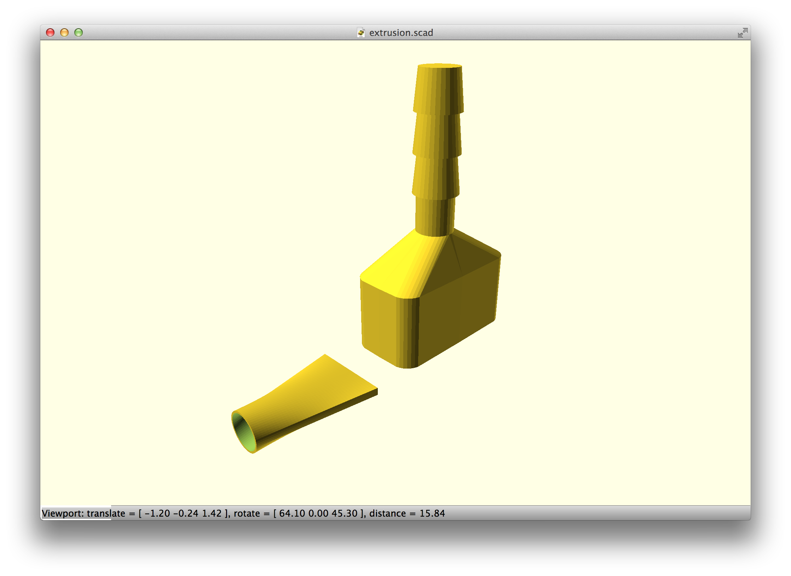
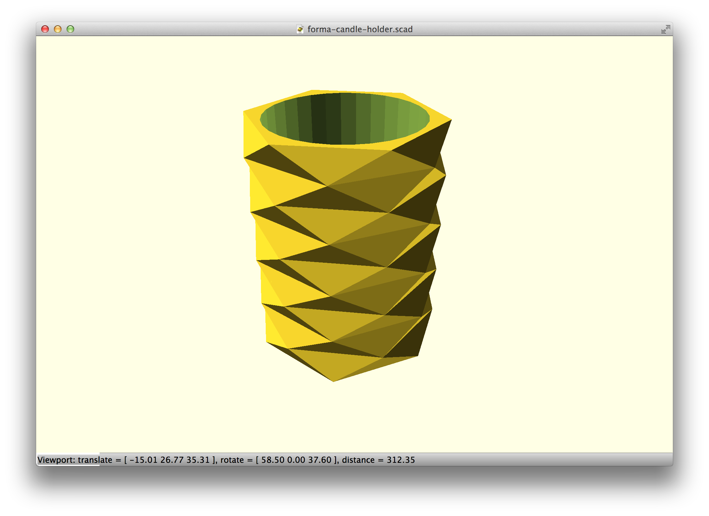
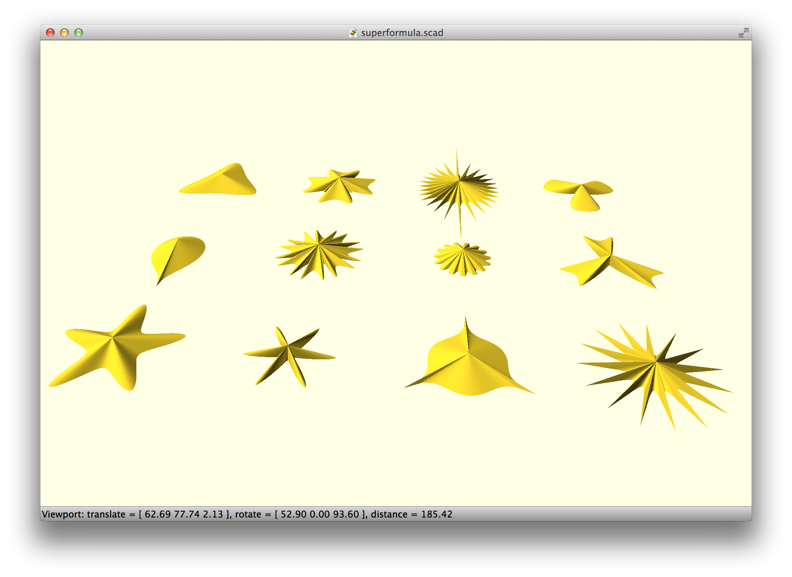
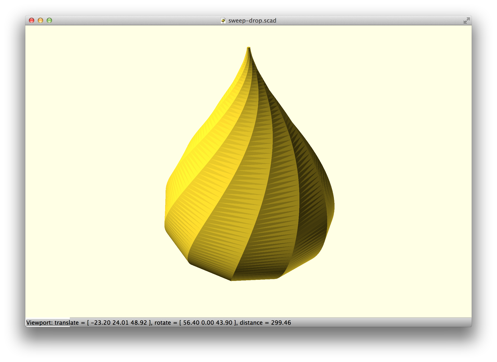
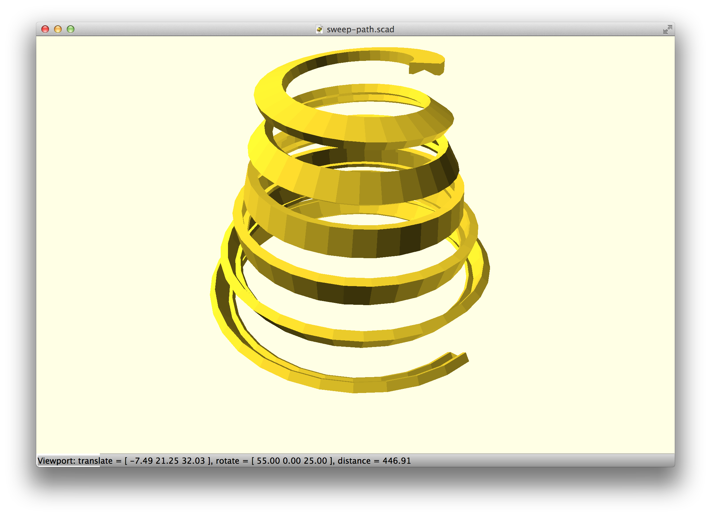
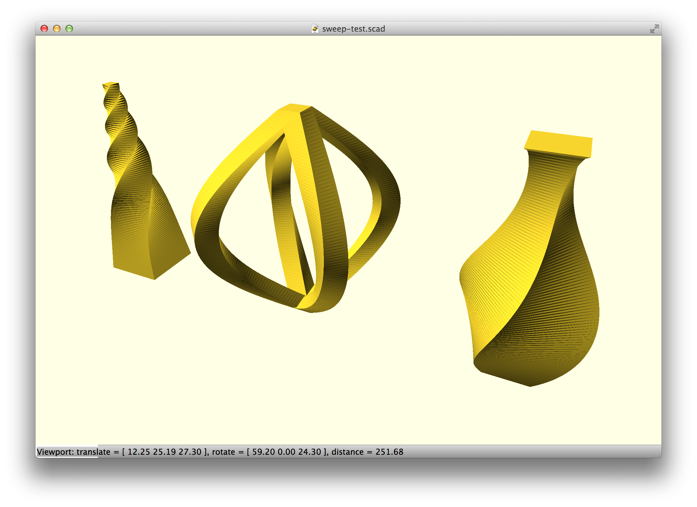
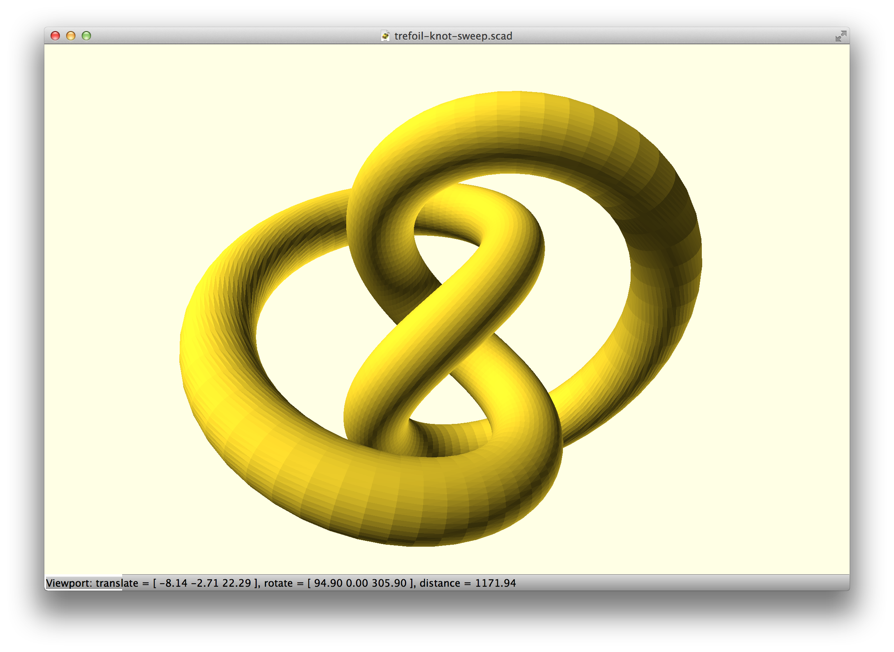
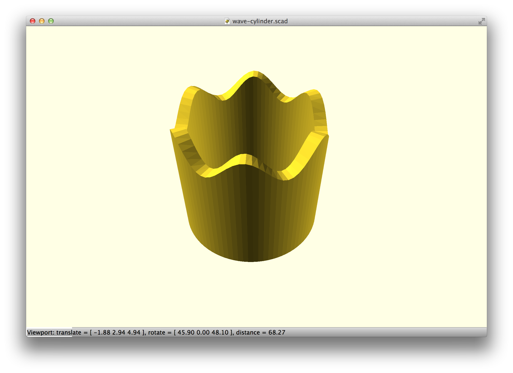
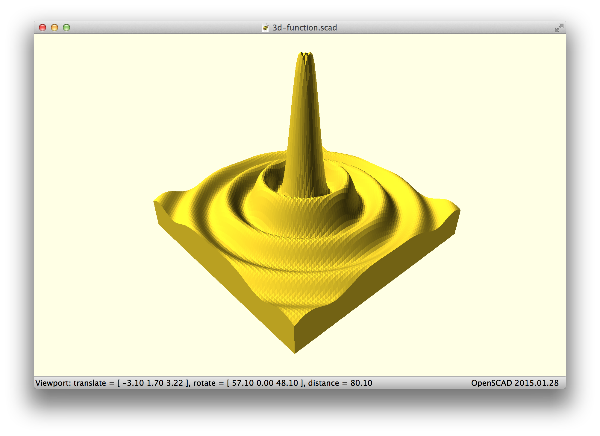
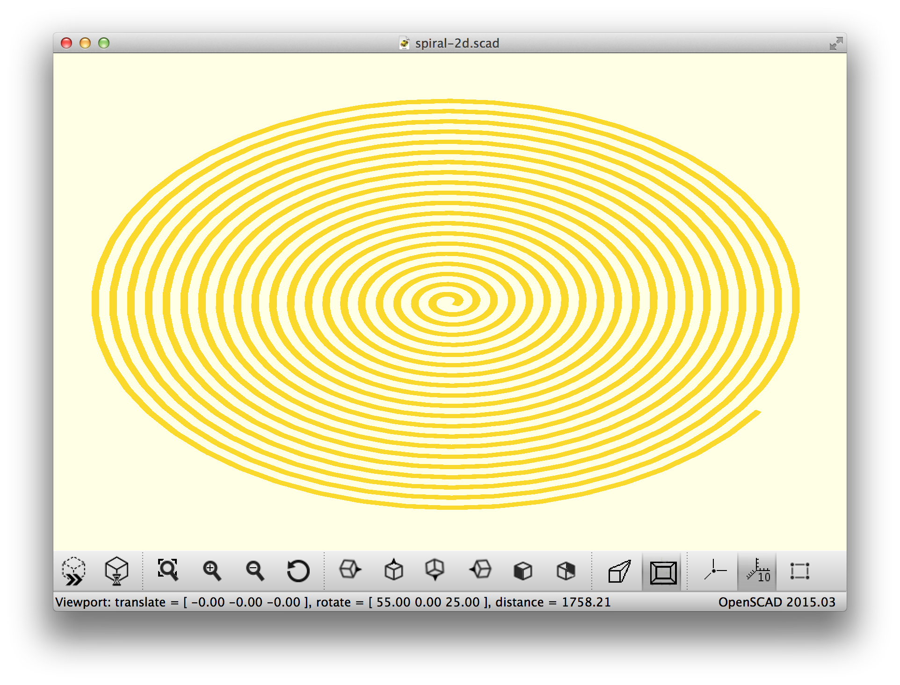

list-comprehension-demos
========================

This repository contains some demos made possible by the addition of list comprehension to OpenSCAD.
In particular it contains a user-space sweep() module which can be used to sweep a 2D shape along a 3D path.

To use these demos, first install the scad-utils library (https://github.com/openscad/scad-utils) in OpenSCAD's library path.

## [extrusion.scad](extrusion.scad)

## [forma-candle-holder.scad](forma-candle-holder.scad)

## [superformula.scad](superformula.scad)

## [sweep-drop.scad](sweep-drop.scad)

## [sweep-path.scad](sweep-path.scad)

## [sweep-test.scad](sweep-test.scad)

## [toothed-belt.scad](toothed-belt.scad)

## [trefoil-knot-sweep.scad](trefoil-knot-sweep.scad)

## [wave-cylinder.scad](wave-cylinder.scad)

## [3d-function.scad](3d-function.scad)

## [spiral-2d.scad](spiral-2d.scad)

